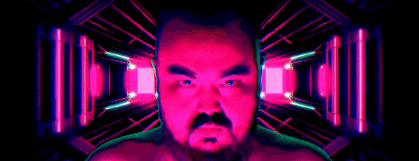
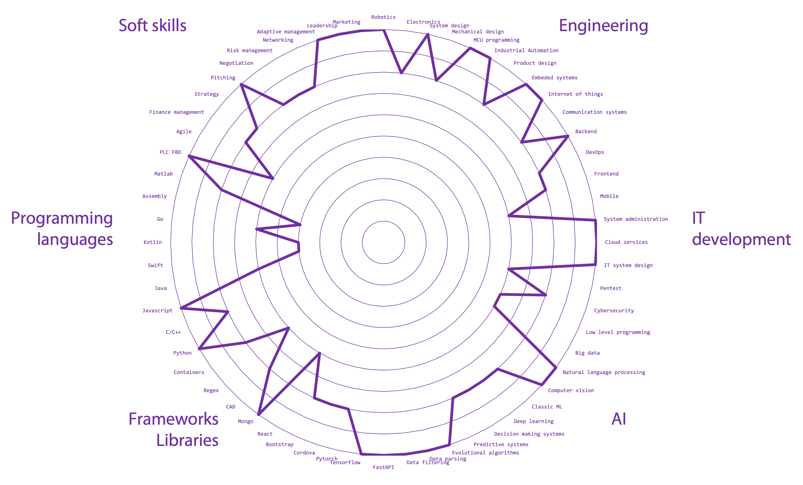
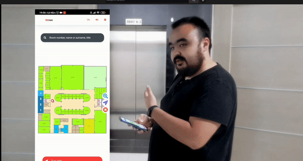

## Hi there, [Bauyrzhan Ospan](https://cleverest.tech) here 👨🏻‍💻

<!-- 

 -->

<!-- 
 -->

## Packages

## Products developed >90% by me

| |  |  |
|- |- |- |
|**Robot Curier:**  Authonomous robot curier that delivers packages. |             | |
|**Qmobot:**  Educational robots. |             | |
|**Cleverest Attendance:**  Attendance system based on BLE beacons. |             ||
|**Tablet Controlled Media:**   Media walls controlled by tablets. |             | |
|**BLE Navigation:**   Indoor high precision navigation app. |             ||

